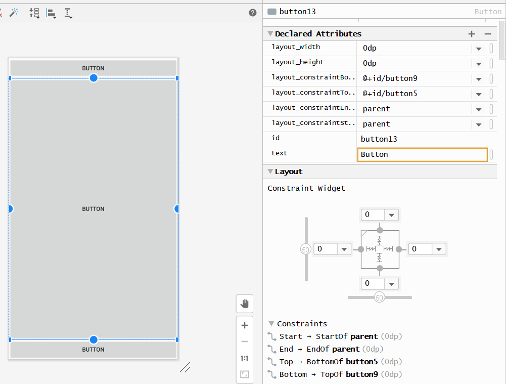
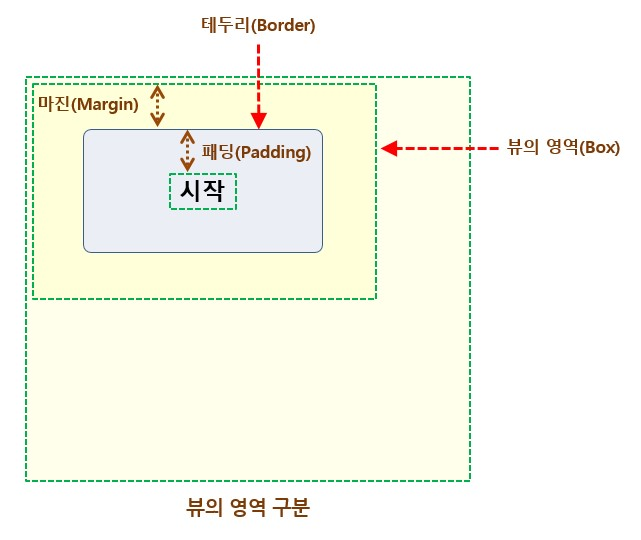
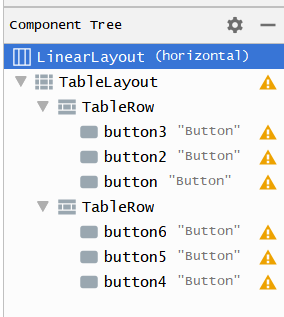

# 둘째마당
---
20200907-20200911

## 01 안드로이드 스튜디오와 친해지기


### Layout?
안드로이드에서 `Activity`로 하나의 화면을 만든다. `Activity`안에 `View`를 추가함으로써 화면 구성요소가 생성되고 `Activity`안의 `View`를 배치하는 것을 `Layout`이라고 한다

* [XML](https://ko.wikipedia.org/wiki/XML)?
    결론은 마크업 언어. HTML이 한계를 극복할 목적으로 만들어졌다. 다소 HTML같이 보인다. XML은 텍스트이며 읽히는 것만을 뜻하지 않는다

* 코드를 수정했는데에도 이전의 에러가 그대로 있다면?
    FILE > Sync Project with Gradle FIles : 빌드 기능을 담당하는 그래들(gradle)이 새로 프로젝트를 빌드하면서 변경된 파일의 내용을 모두 반영할 것

### View?
[참고](https://ehdtjq0411.tistory.com/5)
View는 일반적으로 컨트롤이나 위젯으로 불리는 UI 구성요소. View Group은 여러개의 View를 담고 있는 그릇과 같아서 정확히는 View와 다른 것이다.
viewgroup 또한 하나의 view라고 했을 때 또 다른 viewgroup이 이 viewgroup을 view처럼 다룰 수 있다. 또한 view가 viewgroup을 상속하게 되면 viewgroup도 view가 되므로 viewgroup안의 또 다른 viewgroup을 가질 수 있다

### 위젯과 레이아웃으로 구별되는 뷰
* View : 화면에 추가할 수 있는 모든 것
    * Widget :  일반적인 컨트롤의 역할
    * Layout : 뷰그룹 중에서 내부의 뷰들을 포함하고 있으면서 그것을 배치하는 역할

| 구분             | 설명                                    |
| :--------------- | :-------------------------------------- |
| wrap_content     | 뷰에 들어있는 내용물의 크기에 자동 맞춤 |
| 숫자로 크기 지정 | 크기는 dp나 px 단위가 있어야 함         |

### Constraint?
제약 조건. 뷰가 레이아웃 안의 다른 요소와 어떻게 연결되는지 알려주는 것으로 뷰의 연결점(Anchor Point)와 대상(Target)을 연결한다
* 타깃 요소
    1. 같은 부모 레이아웃 안에 들어 있는 다른 뷰의 연결점
    2. 부모 레이아웃의 연결점
    3. 가이드라인(Guideline)
* 대상 뷰와 타깃 연결점
    1. top, bottom, left(start), right(end)
    2. 가로 축의 가운데(CenterX), 세로 축의 가운데 (CenterY)
    3. 베이스라인(Baseline) -> only if 텍스트뷰

### XML
```xml
<?xml version="1.0" encoding="utf-8"?>
<androidx.constraintlayout.widget.ConstraintLayout xmlns:android="http://schemas.android.com/apk/res/android"
    xmlns:app="http://schemas.android.com/apk/res-auto"
    xmlns:tools="http://schemas.android.com/tools"
    android:layout_width="match_parent"
    android:layout_height="match_parent">

    ...

</androidx.constraintlayout.widget.ConstraintLayout>
```

`android:layout_width`속성에서 앞에 있는 `android:` 는 `xmlns:android`로 지정된 정보를 참조하여 사용한다

| 접두어        | 의미                                                                                                              |
| :------------ | :---------------------------------------------------------------------------------------------------------------- |
| xmlns:android | 안드로이드 기본 SDK에 포함되어 있는 속성을 사용                                                                   |
| xmlns:app     | 프로젝트에서 사용하는 외부 라이브러리에 포함되어 있는 속성을 사용. 다만 app이라는 단어는 다른 것으로 바꿀 수 있음 |
| xmlns:tools   | 안드로이드 스튜디오의 디자이너 도구 등에서 화면을 보여줄 때 쓰임. 앱이 실행될 때는 안보임                         |

* `@+id/아이디값`으로 id값을 쓴다
* view에는 dp(밀도 독립적 픽셀; density independent pixel), 글자 크기에는 sp(축척 독립적 픽셀; scale indepedent pixel)단위를 쓰는 것이 좋다

### 파일 저장 위치

* 소스파일 -> ./main/java/패키지이름/파일이름
* XML 레이아웃 파일 -> ./main/res/layout/파일이름
* 이미지 파일 -> ./main/res/drawable/파일이름

### Mission


## 02 레이아웃 익히기

| 레이아웃 이름               | 설명                                                                                                                                                                                      |
| :-------------------------- | :---------------------------------------------------------------------------------------------------------------------------------------------------------------------------------------- |
| [제약 레이아웃(Constraint L)](#뷰-영역-알아보기) | 제약 조건 기반 모델, 디폴트                                                                                                                                                               |
| [리니어 레이아웃(Linear L)](#뷰-생성하기)   | 박스 모델, 한쪽 방향으로 차례대로 뷰를 추가하며 화면 구성, 뷰가 차지할 수 있는 사각형 영역을 할당                                                                                         |
| [상대 레이아웃(Relative L)](#상대-레이아웃)   | 규칙 기반 모델, 부모 컨테이너나 다른 뷰와의 상대적 위치로 구성, 제약 레이아웃 사용시 상대 레이아웃은 권장하지 않음                                                                        |
| 프레임 레이아웃(Frame L)    | 싱글 모델, 가장 상위에 있는 하나의 뷰 또는 뷰그룹만 보여주는 것, 여러 개의 뷰가 들어가면 중첩하여 쌓음, 가장 단순하지만 여러개의 뷰를 중첩한 후 각 뷰를 전환하여 보여주는 방식, 많이 쓰임 |
| [테이블 레이아웃(Table L)](#테이블-레이아웃)    | 격자 모델, 격자 모양의 배열을 사용하여 화면을 구성, HTML에서 많이 사용하는 정렬 방식과 유사 하지만 많이 쓰이지는 않음                                                                     |

### 뷰 영역 알아보기


만약 MainActivity 파일이 아닌 다른 파일로 실행하고자 한다면 `AndroidManifest.xml` 속에 `<activity android:name=".수정된파일이름">` 로 수정해줘야 한다

```java
public class LayoutCodeActivity extends AppCompatActivity {
    @Override
    protected void onCreate(Bundle savedInstanceState) {
        super.onCreate(savedInstanceState);
        
        //new 연산자를 통해 리니어 레이아웃을 만들고 방향을 설정함->vertical
        LinearLayout mainLayout = new LinearLayout(this);
        mainLayout.setOrientation(LinearLayout.VERTICAL);
        
        //new 연산자로 레이아웃 안에 추가될 뷰들에 대한 파라미터 설정 -> params
        LinearLayout.LayoutParams params =
                new LinearLayout.LayoutParams(
                        LinearLayout.LayoutParams.MATCH_PARENT,
                        LinearLayout.LayoutParams.WRAP_CONTENT
                );
        
        //버튼에 파라미터 설정 -> button1 하고 레이아웃에 추가함
        Button button1 = new Button(this);
        button1.setText("Button1");
        button1.setLayoutParams(params);
        mainLayout.addView(mainLayout);
        
        //새로 만든 레이아웃을 화면에 설정
        setContentView(mainLayout);
    }
}
```
```java
    <application
        android:allowBackup="true"
        android:icon="@mipmap/ic_launcher"
        android:label="@string/app_name"
        android:roundIcon="@mipmap/ic_launcher_round"
        android:supportsRtl="true"
        android:theme="@style/AppTheme">
        //이 부분을 수정한 것
        <activity android:name=".LayoutCodeActivity">
        //
            <intent-filter>
                <action android:name="android.intent.action.MAIN" />
                <category android:name="android.intent.category.LAUNCHER" />
            </intent-filter>
        </activity>
    </application>
```

### 화면 생성과정 분석하기
XML 레이아웃에서 정의할 수 있는 대부분의 속성은 자바 소스 코드에서도 사용할 수 있도록 소스코드로 제공함

* `this` : Context 객체가 전달된 것으로 new 연산자를 사용해서 뷰 객체를 코드에서 만들 때는 항상 Context 객체가 전달되어야 한다

* `Context` : 어떤 일이 발생한 상황. 객체의 정보를 담고 있는 객체. 뷰에 대한 정보를 손쉽게 확인하거나 설정할 수 있도록 뷰의 생성자에 context 객체를 전달한다.

### 뷰 정렬하기
[참고](https://dayglo.tistory.com/63)

|   정렬 속성    | 설명                                                                                                   |
| :------------: | :----------------------------------------------------------------------------------------------------- |
| layout_gravity | 부모 컨테이너의 여유 공간에 뷰가 모두 채워지지 않아 여유 공간이 생겼을 때 여유 공간 안에서 뷰를 정렬함 |
|                | 뷰의 layout_width나 layout_height 속성을 wrap-content로 만든 후 사용 가능                              |
|                | 속성이 뷰가 어디에 위치할 것인지 결정                                                                  |
|    gravity     | 뷰 안에 표시하는 내용물을 정렬함                                                                       |

### 뷰 생성하기

첫줄 맨 앞을 LinearLayout으로 고쳐줘야 함.

```java
<LinearLayout xmlns:android="http://schemas.android.com/apk/res/android"

    android:layout_width="match_parent"
    android:layout_height="match_parent"
    android:baselineAligned="false"
    android:orientation="horizontal">
    
    <TextView
            android:layout_width="wrap_content"
            android:layout_height="wrap_content"
            android:id="@+id/textview4"
            android:text="큰글씨"
            android:textColor="#ffff0000"
            android:textSize="40sp" />
</LinearLayout>
```

#### Padding이나 Layout_Margin
공간이 없으면 뷰들이 밀리는 현상이 발생할 수 있음. 따라서 Padding이나 Layout_Margin 속성을 지정할 때 부모 컨테이너에 남아 있는 공간이 충분한지 고려해야 레이아웃이 망가지지 않음

#### 여유 공간을 분할하는 layout_weight 속성
[layout_weight](https://yoo-hyeok.tistory.com/56) 속성은 부모 컨테이너에 남아 있는 여유 공간을 분할하여 기존에 추가했던 뷰들에게 할당할 수 있다. 다만 분할하려는 방향에 따라 `layout_height`나 `layout_width` 는 `0dp`가 되어야 한다

### 상대 레이아웃
```java
    <Button
        android:id="@+id/button3"
        android:text="Button" 
        android:layout_width="match_parent"
        android:layout_height="match_parent"
        //
        android:layout_alignParentStart="true"
        android:layout_alignParentLeft="true"
        //
        android:layout_marginStart="0dp"
        android:layout_marginTop="0dp"
        android:background="#ff0088ff"
        //
        android:layout_above="@+id/button4"
        android:layout_below="@+id/button5"
    />
```

### 테이블 레이아웃
테이블 레이아웃은 각각의 행과 그 안에 여러 개의 열을 넣어 레이아웃을 구성한다. 테이블 레이아웃 안에는 `TableRow`라는 태그가 한 행을 의미한다. `TableRow` 안에는 여러 개의 뷰가 들어가게 되는데 이 뷰들은 각각 하나의 열이 된다.



`layout_span` 은 뷰가 여러 칼럼에 걸쳐 있도록 만들기 위한 속성이며 뷰가 몇 개의 칼럼을 차지하게 될 것인지 숫자로 지정하는 것